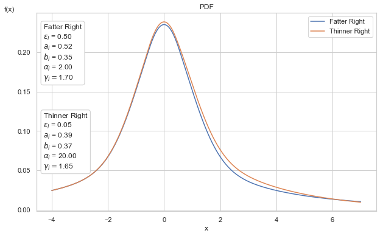

# P.H.A.T. - **P**areto **H**ybrids with **A**symmetric **T**ails #

The **Phat** distribution is an attempt to address the issues of fat tails in two-tailed data. It is a two-tailed, fully-continuous, well-defined asymmetric power law probability distribution. 

It is a mixture model of two Pareto hybrid distributions, as described in [2009 by Julie Carreau and Yoshua Bengio](https://www.researchgate.net/publication/226293435_A_hybrid_Pareto_model_for_asymmetric_fat-tailed_data_The_univariate_case) (and dubbed by us as the "Carben" distribution), with:

+ Gaussian body 
+ distinct Pareto power laws in either tail.

The distribution requires only 4 parameters:

+ mu, sigma in the Gaussian body
+ xi_left, xi_right, being the inverse tail index (1/alpha) for either Paretian tail.

The **phat-tails** package makes available several methods to fit a given time-series dataset to the parameters of the Phat distribution and produce a forecast with the results.

## Documentation ##
[](https://phat.readthedocs.io/en/latest)

## Installation ##

Installation available via `pip`

```console
$ pip install phat-tails
```

## Quickstart ##

All pertinent classes and functions are imported via the module `phat`.


```python
import phat as ph
```

The probability distribution is found in the main class, `Phat`, which mimics the structure of the [continuous distributions found in scipy.stats](https://docs.scipy.org/doc/scipy/tutorial/stats/continuous.html#continuous-distributions-in-scipy-stats). 

We pass the four parameters to instantiate the distribution. For simplicity, we will show the distribution with equal tail indices initially.


```python
mean, sig, shape = 0, 1, 1/5
phat_dist = ph.Phat(mean, sig, shape, shape)
```

Below is a complete rendering of the distribution, with breakdown among the component Gaussian and Pareto tails.

    

    


Below we demonstrate the ability to generate asymmetric tails. We overlay two different Phat distributions, one with symmetric tail indices of alpha = 2 and the other with *asymmetric* tail indices, alpha = 2 and alpha_right = 20.

We can see that the left tails are identical. In the right tails, the distributions appear to differ only modestly, however, [this difference leads to dramatically different effects](demo.ipynb#Compare-Fit-with-Gaussian-and-T).


```python
mean, sig = 0, 1
shape_l1, shape_r = 1/2, 1/2
dist1 = ph.Phat(mean, sig, shape_l1, shape_r)
shape_l2, shape_r = 1/2, 1/20
dist2 = ph.Phat(mean, sig, shape_l2, shape_r,)
```

    

    


The `Phat` class has common methods such as `pdf`, `cdf`, `sf`, `ppf`. It can also calculate negative log-likelihood and first and second moments. Derivations are [found here](moments.ipynb).


```python
mean, sig, shape_l, shape_r = 0,1, 1/5, 1/4
phat_dist = ph.Phat(mean, sig, shape_l, shape_r)
phat_dist.pdf(10)
```


    array([0.00482994])


```python
phat_dist.cdf([.05,1,-0.1])
```


    array([0.51144212, 0.70624103, 0.47567736])


```python
phat_dist.sf([.05])
```


    array([0.48855788])


```python
assert phat_dist.sf([.05]) == 1 - phat_dist.cdf([.05])
```


```python
import numpy as np
phat_dist.ppf(np.linspace(0,1,5))
```


    array([       -inf, -1.63735173,  0.00569209,  1.68013031,         inf])


```python
phat_dist.nll(1) # Negative Log-Likelihood
```


    array([1.8510368])


```python
phat_dist.mean()
```


    0.0796142959815449


```python
phat_dist.std()
```


    3.7926873955033087


It can also generate random variables (and standardized random variables).


```python
phat_dist.rvs(20)
```


    array([  0.26230724,  -2.86701052,   1.10667151,  -1.44804104,
            -1.11322731,  -1.02824889,  -1.85262802,   1.8933799 ,
            16.08664357, -12.73459004,   1.37070181,   2.57394117,
             1.64309126,  -0.56376192,  -1.60433492, -19.06879003,
             5.0930153 ,  -2.66486303,  -0.58754918,  -3.191044  ])


```python
phat_dist.std_rvs(20)
```


    array([-0.42959327, -0.76187685, -0.79643119, -0.81966234, -1.71745892,
            0.16728373, -0.1375456 ,  0.36916545,  3.5360414 , -0.62137662,
           -0.37860114,  1.14978021, -1.04659032, -0.12308385,  0.62170651,
           -0.5693838 ,  0.50893717, -0.0747743 ,  0.5675617 ,  0.15844071])


`Phat` has a `fit` method, which generates a [standard Maximum Likelihood Estimate (MLE)](mle_fit.ipynb), *although this is not the recommended approach to fitting this distribution*.

In addition to the main distribution class, the package also provides:

+ `ph.two_tailed_hill_double_bootstrap`: [a method for estimating both tail indices of a dataset simultaneously](dblbs.ipynb)
+ `ph.PhatNet`: [a simple neural network that provides improved fit relative to MLE](nn_fit.ipynb), which includes a custom loss function called `PhatLoss`.
+ `ph.Garchcaster`: [a class for generating time-series forecasts from ARMA and GARCH models that incorporates Phat random innovations](phatgarch.ipynb).

## Dependencies ##

+ Python versions: 3.9
+ numpy 1.19.5
+ numba 0.53.*
+ scipy 1.7.*
+ scikit-learn 0.24.*
+ statsmodels 0.12.*
+ tensorflow 2.5.0
+ tensorflow-probability 0.12.2
+ matplotlib 3.5.1
+ arch 4.19
+ pmdarima 1.8.2
+ tqdm 4.61.2

Also see requirements and compatibility specifications for [Tensorflow](https://www.tensorflow.org/install) and [Numba](https://numba.readthedocs.io/en/stable/user/installing.html)

### Suggested ###
+ [tensorboard](https://www.tensorflow.org/tensorboard/get_started): monitoring tool for tensorflow
+ [yfinance](https://github.com/ranaroussi/yfinance): for downloading historical price data

### Also Check Out ###

+ [tail-estimation](https://github.com/ivanvoitalov/tail-estimation)
    + built as part of [Ivan Voitalov et al (2019)](https://journals.aps.org/prresearch/pdf/10.1103/PhysRevResearch.1.033034) on tail index estimation techniques for power law phenomenon in scale-free networks
    + code from this package is utilized in the `two_tailed_hill_double_bootstrap` function
+ [thresholdmodeling](https://github.com/iagolemos1/thresholdmodeling) for a package on manual Peak-over-Threshold (PoT) analysis.

## Enhancements ##

Potential enhancements under consideration:

+ truncated Pareto tails
+ additional tail index estimation techniques
+ integration with Heston or other stochastic volatility models
+ incorporation of Phat innovations into `fit` of AR-GARCH or ARMA-GARCH via custom model
+ generalization to additional GARCH models
+ better optimization of `Garchcaster.forecast` method
